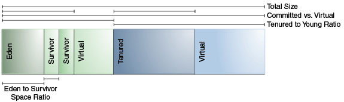

# 4 Sizing the Generations 设置分代大小
下图描述了堆内存已提交空间和虚拟空间的区别。在JVM启动初期，所有的内存空间都是保留的。保留的空间可以通过`-Xmx`参数来指定。如果`-Xms`参数比`-Xmx`参数要小，那么不是所有的空间都会立即提交到JVM。所有未提交的空间都标记为virtual(虚拟的)。如果系统需要，每个分代的heap空间都会增长到虚拟空间的最大值。
>个人理解，系统初始化时有部分空间是未使用的，这些空间就是虚拟的，随着系统的负载升高，JVM会消耗这些虚拟空间，直到虚拟空间分配完毕。

一些参数设定的是heap中各部分的比例。例如`NewRatio`参数表示tenured区和young区的比。

## Total Heap 堆的总量
下面将要导论的heap动态增长和heap的默认大小不适用与parallel collector。不过，控制heap总大小的参数和分代大小的参数是适用于parallel collector的。

影响垃圾回收性能的最重要的因素是**总可用内存**。因为gc是在分代内存用完之后发生的，吞吐量与可用内存数量成反比。

默认的，jvm在每次GC时增大或减小heap大小来保证特定可用空间给那些存活的对象。这个特定的空间范围可以通过
`-XX:MinHeapFreeRatio=<minimum>和-XX:MaxHeapFreeRatio=<maximum>`参数来指定，而且总大小在`-Xms<min>`和`-Xmx<max>`之间。64bit的Solaris操作系统的默认参数如下表所示：

|Parameter         | DefaultValue|
|:-------:         |:-----------:|
|MinHeapFreeRatio  |40           |
|MaxHeapFreeRatio  |70           |
|-Xms              |6656k        |
|-Xmx              |calcalated   |

根据这些参数，如果一个generation中的空闲空间小于40%,这个generation将会扩展，直到拥有40%的空闲空间或到了generation的最大值。类似的，如果空闲空间大于70%,这个generation就会收缩，直到符合70%。

就像上表所说的，默认的最大heap size是JVM计算出来的。这个计算过程之前是Java SE用于parallel collector和server JVM的，现在适用于所有的垃圾回收器。其中关于heap size的最大限制在32位平台和64位平台略有不同。具体可以看The Parrallel Collector章节。

下面三条建议是关于服务端应用的：
* 除非你遇到停顿时间过长的问题，否则尽可能多的给JVM分配更多的内存。默认大小往往都太小了。
* 将`-Xms`和`-Xmx`参数设置成相同的值可以去掉JVM做的那些动态扩缩Heap的操作。但是，如果你这么搞其实是不合理的，JVM也没办法帮你做调整了，因为你选择固定大小的堆。
* 通常，提升内存时CPU核数也要提升，内存分配也可以并行化。

## The Young Generation 年轻代
除了总可用内存大小，拥有第二影响力的参数是young区占总heap的比例。young区越大，minor gc发生频率越小。然而，对于一个有界的heap，更大的young区往往意味着你的tenured区很小，这会提升major gc的次数。具体如何选择，取决于你的存活对象分布图。

默认情况下，young区大小受参数`NewRatio`控制。例如，设置`-XX:NewRatio=3`意味着young:tenured=1:3，换句话说，eden+2 survivor区的大小是整个堆的4分之一。

参数`NewSize和MaxNewSize`标记了young区的上下界。将这两个值设置成一样就将young区设置为定长的，就像你把`-Xms和-Xmx`设置成定长的也就固定了heap大小一样。

## Survivor Space Sizing 设置Survivor区大小
你可以使用`SurvivorRatio`参数来调整survivor区的大小，不过大多数这都不怎么影响性能。例如，`-XX:SurvivorRatio=6`参数表示eden:survivor=1:6。换句话说，每个survivor区的大小占1个eden区大小的6分之1，也是young区的8分之1。

如果survivor区太小，复制回收时多出来的对象会直接进tenured generation。如果survivor区太大，会造成空间浪费。每次回收时，jvm会选择一个阈值，这个值是一个对象进入tenured区之前的复制次数。这个值最好能刚好让2个survivor区中的一个是满的。如果这个值太小，可能survivor没满对象就进老年代了，如果太大，直接就进老年代了。`-XX:+PrintTenuringDistribution`参数(不是所有的回收器都提供)可以显示young区中对象的复制阈值。如果要观察对象的分布图，这个参数也是很有用的。

下表提供了64 bit Solaris的默认参数：

|Parameter    |Server JVM Default Value|
|:-------:    |:----------------------:|
|NewRatio     |2                       |
|NewSize      |1301M                   |
|MaxNewSize   | not limited            |
|SurvivorRatio|8                       |

young区的最大值会根据heap size和NewRatio参数来计算。当然了，如果你设置了`MaxNewSize`，那就有限制了。

下面几条是服务端应用的建议：
* 先决定你能给JVM多少heap。再划出应用性能和young区大小关系曲线，寻找最佳的设置。
		* 注意heap size一定要比物理机内存小，否则会有问题。
* 如果heap size是固定的，那么提高young区大小会降低tenured区大小。要保证tenured区足够大，在程序任意时刻都能够装下所有的存活对象，此外，还要提供20%左右的额外空间。

> 我要是能做到上面那一点，那这世界上还会有OOM吗？

* Subject to the previously stated constraint on the tenured generation:(这句话我没理解)
		* 给young区足够的空间。
		* 提升young区时也提高cpu核数，因为可以并行分配内存 